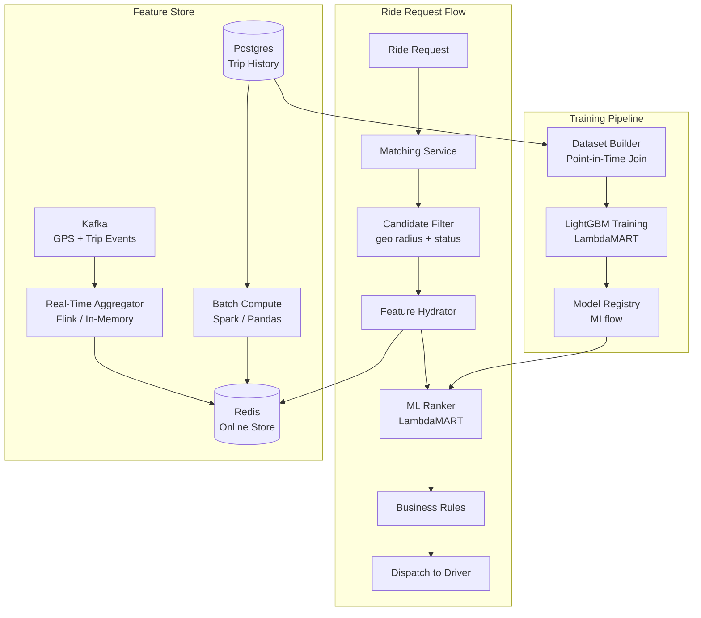
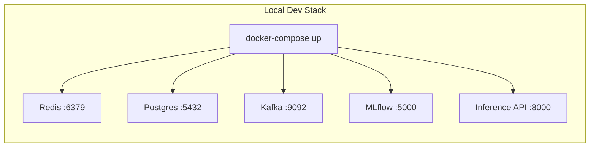

# Rider-Driver Matching Service

ML-powered ranking of candidate drivers for ride requests using real-time features and a LambdaMART learning-to-rank model.

## Architecture





## Project Structure

```
feature_engine/     # Real-time & batch feature computation + online store
training/           # LambdaMART model training, evaluation, export
inference/          # FastAPI serving with ONNX/LightGBM ranker
scripts/            # DB init, feature seeding
```

## Prerequisites

- Python 3.11+
- Docker & Docker Compose

## Quick Start

```bash
# 1. Install dependencies
pip install -r requirements.txt

# 2. Generate synthetic training data
make generate-data

# 3. Train the ranking model
make train

# 4. Start infrastructure (Redis, Postgres, Kafka, MLflow)
make docker-up

# 5. Seed Redis with sample features
make seed

# 6. Run the inference service
make serve
# API available at http://localhost:8000
```

## Run Tests

```bash
# All unit tests (no infrastructure needed)
make test

# With coverage report
make test-cov
```

## API Usage

```bash
curl -X POST http://localhost:8000/match \
  -H "Content-Type: application/json" \
  -d '{
    "ride": {
      "request_id": "r123",
      "rider_id": "rider_42",
      "pickup_lat": 37.7749,
      "pickup_lng": -122.4194,
      "destination_lat": 37.8044,
      "destination_lng": -122.2712,
      "surge_multiplier": 1.2
    },
    "candidates": [
      {"driver_id": "d_1", "eta_seconds": 120, "lat": 37.77, "lng": -122.42},
      {"driver_id": "d_2", "eta_seconds": 60, "lat": 37.775, "lng": -122.418},
      {"driver_id": "d_3", "eta_seconds": 240, "lat": 37.78, "lng": -122.41}
    ]
  }'
```

### Health Check

```bash
curl http://localhost:8000/health
```

## Makefile Commands

| Command | Description |
|---------|-------------|
| `make install` | Install Python dependencies |
| `make generate-data` | Create synthetic training data |
| `make train` | Train model (LightGBM native export) |
| `make train-onnx` | Train model (ONNX export) |
| `make serve` | Start inference API on :8000 |
| `make docker-up` | Start all infrastructure |
| `make docker-down` | Stop all infrastructure |
| `make seed` | Seed Redis with sample features |
| `make test` | Run all tests |
| `make test-cov` | Run tests with coverage |
| `make clean` | Remove generated files |
